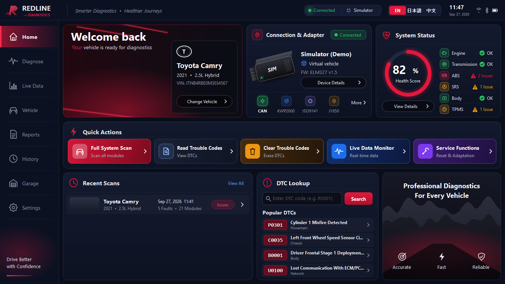
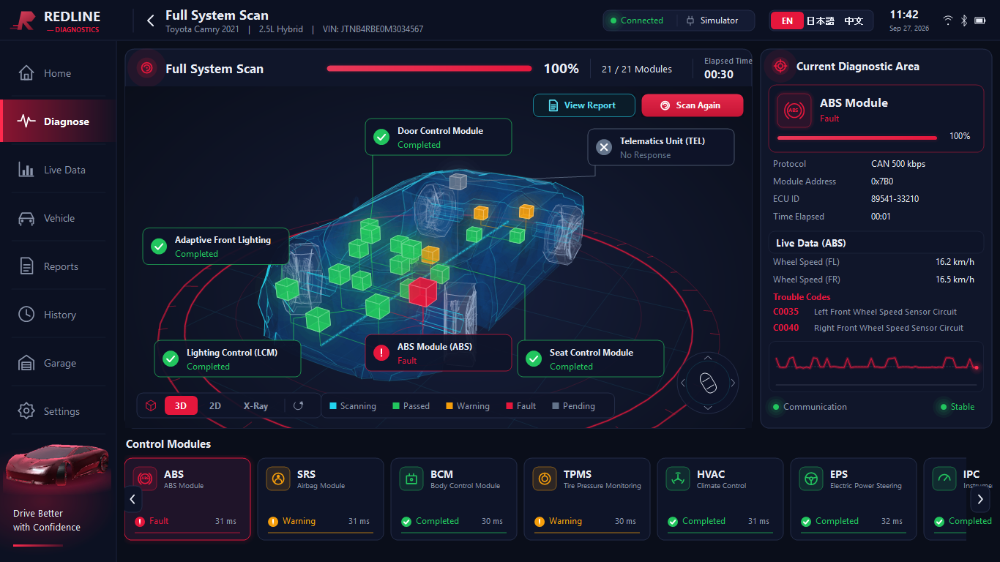

# Redline Diagnostics

Full-screen (1366 × 768) OBD-II vehicle diagnostics workstation for Windows, built on
**.NET Framework 4.7 / Windows Forms** with a self-contained software 3D renderer.
The UI is available in **English, Japanese and Chinese** and can be switched live.





## Features

| Area | What it does |
| --- | --- |
| **Home dashboard** | Welcome card with the active vehicle, adapter card (device, link, firmware, active protocol family), health score ring with per-system status from the last scan, quick actions (scan, read / clear codes, live data, service functions), recent scans, DTC lookup with popular codes. The car pictures are rendered from the loaded 3D model with an opaque studio shader (smooth Blinn-Phong, red rim and floor bounce light, 2x supersampling) on a background thread. |
| **Full System Scan** | Walks every control module (21 modules in the bundled catalog), probes it, identifies the ECU, samples its live channels and reads stored / pending / permanent trouble codes (SAE J1979 and UDS 19 02). Progress is visualised in 3D: glowing module markers, an animated CAN harness, a scanning sweep plane and floating callouts. |
| **3D vehicle view** | Real car meshes (glTF/GLB or OBJ) rendered with GDI+: painter's algorithm, holographic fills, crease + silhouette outlines. 3D / 2D (top-down blueprint) / X-Ray modes, mouse orbit and zoom, auto-rotate, mini navigator. Dense models are simplified at load time with quadric edge collapse (213k → 7k triangles in about 3 s). A procedural sedan is the fallback when no model is available. |
| **Adapters** | ELM327 over USB or Bluetooth SPP (COM port), ELM327 WiFi (TCP), OBDLink MX+/SX (STN), and a built-in **Simulator** with a virtual hybrid sedan so the whole application can be exercised without hardware. |
| **Protocols** | Auto-detect or force: SAE J1850 PWM/VPW, ISO 9141-2, KWP2000 (slow / fast), CAN 11/29-bit at 250/500 kbps. ISO-TP multi-frame reassembly, per-module physical addressing (`AT SH` / `AT CRA` / flow control). |
| **Live Data** | Real-time ECM parameters (RPM, speed, coolant, load, throttle, IAT, MAF, fuel trims, voltage, timing, fuel level) with sparklines; per-module channels (wheel speeds, tyre pressures, HV battery, EPS…) while a module is selected. |
| **Database** | Embedded CSV tables: 320+ DTC definitions in EN/JA/ZH with family fallbacks for unknown codes, 75 mode-01 PIDs, 21 control modules with CAN addresses and 3D positions, VIN WMI manufacturer table. Drop extra CSVs into a `Data` folder next to the executable to extend it. |
| **Vehicle** | VIN decoding, MIL status, DTC count, I/M readiness monitors, supported-PID discovery. |
| **Reports / History / Garage** | HTML reports in the current language with in-app preview, JSON scan history, saved vehicle profiles. |

## Building

Requirements: Visual Studio 2022 **or** the .NET SDK (the project is SDK-style and targets `net47`).

```powershell
dotnet build RedlineDiagnostics.sln -c Release
# output: src\RedlineDiagnostics\bin\Release\net47\RedlineDiagnostics.exe
```

The executable has no runtime dependencies beyond .NET Framework 4.7.

## Running

* **Full screen** (default): the borderless window covers the entire primary display, so the taskbar is hidden.
  The layout is a fixed 1366 × 768 canvas: it fills a 1366 × 768 screen exactly and is centred on a black
  backdrop on larger screens. `F11` switches between full screen and a 1366 × 768 window (also in
  Settings → Display), `Esc` returns Home / exits, `F1`–`F8` jump to pages.
* On first start the **Simulator** adapter is selected and connects automatically; press **Full System Scan**.
* Real hardware: open **Settings**, pick the adapter type, COM port / baud (Bluetooth SPP adapters
  appear as COM ports) or WiFi host, optionally force a protocol, then **Test Connection**.
* Language: click **EN / 日本語 / 中文** in the top bar.

### Supported OBD-II adapters

The application talks the ELM327 AT command set, which covers the large majority of consumer OBD-II dongles.
The adapter must present itself to Windows as a **serial port** or a **TCP socket**:

| Adapter | How it appears | Settings |
| --- | --- | --- |
| ELM327 USB (FTDI / CH340 / CP210x clones, OBDLink SX, Vgate, Konnwei…) | COM port | `ELM327 USB`, pick the COM port and baud (38400 default; 115200 / 500000 for fast clones and STN devices) |
| ELM327 Bluetooth Classic (SPP profile: Vgate iCar Pro BT3.0/4.0 in SPP mode, Veepeak BT, KIWI 3 BT, most cheap BT dongles) | COM port created when paired in Windows Bluetooth settings | `ELM327 Bluetooth`, pick the outgoing COM port |
| ELM327 WiFi (Vgate iCar WiFi, KIWI WiFi, Carista WiFi…) | TCP server, usually `192.168.0.10:35000` | `ELM327 WiFi`, host and port |
| OBDLink MX+, EX, LX, SX (STN11xx / STN22xx) | COM port (USB or Bluetooth) | `OBDLink MX+ / SX`; STN extensions (`ST` commands) are used when available |

Every vehicle-side protocol an ELM327 offers is supported: SAE J1850 PWM and VPW, ISO 9141-2, ISO 14230-4 KWP2000
(slow and fast init) and ISO 15765-4 CAN (11 / 29-bit, 250 / 500 kbps), auto-detected or forced in Settings.
Manufacturer-specific modules (ABS, SRS, BCM, …) are reached through UDS on CAN vehicles; on pre-CAN vehicles only
the modules that answer the standard J1979 requests (ECM / TCM) are reported.

Not supported: Bluetooth Low Energy-only adapters (OBDLink CX, Veepeak BLE+, most iOS-oriented dongles), SAE J2534
pass-thru interfaces (Tactrix, Drew Tech, OEM interfaces), proprietary scan tools (Autel, Launch) and raw CAN interfaces
(PCAN, Kvaser, SocketCAN). The transport layer is an interface (`IObdTransport`), so a further device type only needs a
new transport class plus an entry in `AdapterType`.

### Automated UI check

```powershell
RedlineDiagnostics.exe --autotest C:\temp\shots
```

Runs an unattended session off-screen (simulator scan, language switch, view modes, report, live data,
all pages) and writes a PNG of every step. Useful for visual regression checks.

`--autotest-home <dir>` captures only the Home page in EN / JA / ZH (about 8 s), and `--render-cars <dir>` writes the
Home page car renders (hero, rear, thumbnail, sidebar) as PNG files and exits.

## Project layout

```
src/RedlineDiagnostics
├─ App/            Theme, vector icons, settings, AppState (connection, scan, vehicles, history)
├─ Localization/   Loc (runtime language switch) and the EN/JA/ZH string table
├─ Rendering3D/    Vec3/Mat4 math, Mesh, procedural CarMeshFactory, OBJ / glTF loaders, QEM simplifier,
│                  GDI+ Renderer (holographic views) and StudioRenderer (opaque lit stills)
├─ Obd/            Transports (Serial/TCP/Simulator), Elm327Adapter, ISO-TP response parser,
│                  PID formulas, DTC parsers, ELM327 + virtual vehicle simulator
├─ Database/       Embedded CSV loaders (DTC, PID, module catalog, VIN WMI) + Data/*.csv
├─ Diagnostics/    ScanEngine, LiveDataMonitor, LiveParam channel definitions, history, HTML reports
├─ Controls/       Custom-painted widgets: TopBar, SideNav, Vehicle3DView, CarImages (cached car renders), module cards,
│                  diagnostic area panel, buttons, lists, sparklines
└─ Forms/          MainForm shell and the eight pages
```

## 3D models

Models are read from the `Models` folder next to the executable (copied from `assets/models` at build time)
and can be switched in **Settings → 3D Vehicle Model**, or any `.glb` / `.gltf` / `.obj` file can be chosen
with **Custom file…**. Loading runs on a background thread; the procedural car is shown until the file is ready.

| File | Source | Licence |
| --- | --- | --- |
| `CarConcept.glb` (default) | [Khronos glTF Sample Assets – Car Concept](https://github.com/KhronosGroup/glTF-Sample-Assets/tree/main/Models/CarConcept), based on a CC0 model by Unity Fan; geometry-only copy (textures stripped) | CC-BY 4.0 (Khronos logos excluded) |
| `sedan.obj`, `sedan-sports.obj`, `suv.obj`, `hatchback-sports.obj` | [Kenney Car Kit](https://kenney.nl/assets/car-kit) | CC0 |

Import pipeline: node hierarchy and transforms → triangles → part classification from node / mesh / material
names (`glass`, `wheel`, `interior`, …) → normalisation to a 4.85 m wheelbase footprint resting on the ground →
quadric-error-metric simplification with boundary preservation (a 40k-face exterior-only copy is kept for the Home page
renders, the 3D views use 7k faces) → crease detection. Small trim parts (wipers,
gaskets, pedals, badges) are skipped because they only add noise at this scale.

## Extending

* **More modules**: add rows to `Database/Data/modules.csv` (request/response CAN id, 3D position, icon)
  and, if the module has manufacturer live data, its `LiveParam` channels in `Diagnostics/LiveParam.cs`.
* **More DTCs**: append to `dtc_codes.csv` (`code,en,ja,zh`) or ship a `Data\dtc_codes.csv` beside the exe.
* **Another car model**: drop a `.glb`, `.gltf` or `.obj` into `assets/models` (it becomes a bundled choice) or pick
  it as a custom file in Settings. Use **Flip front / back** if the model was authored facing the other way.
